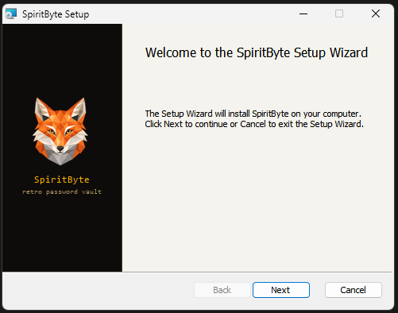
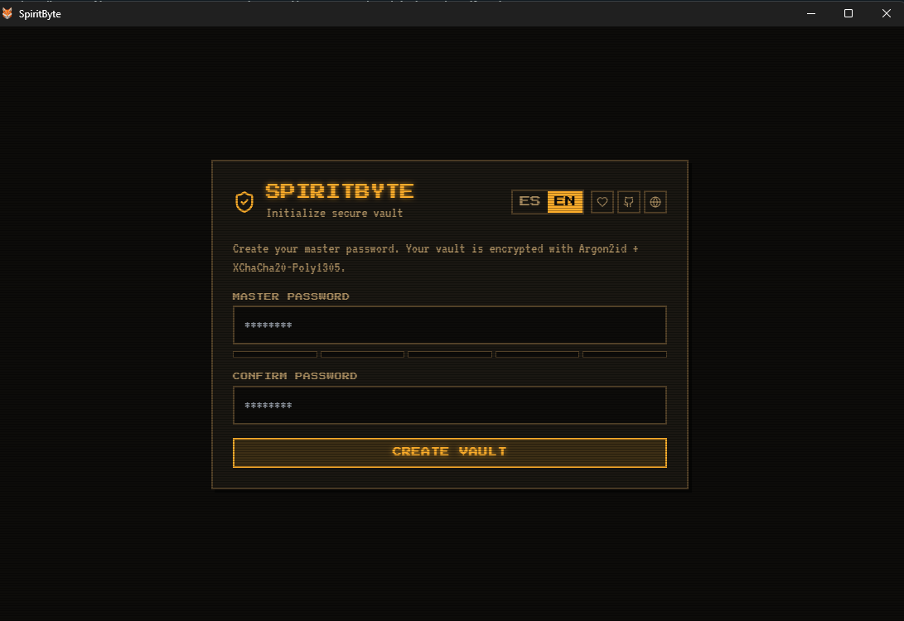
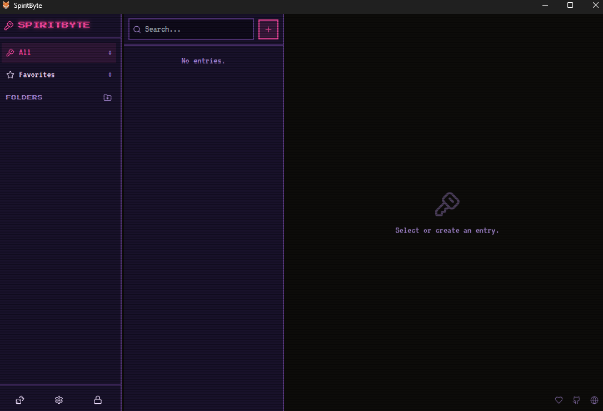
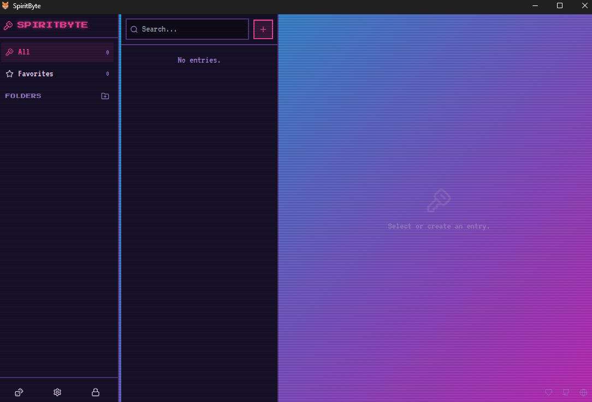
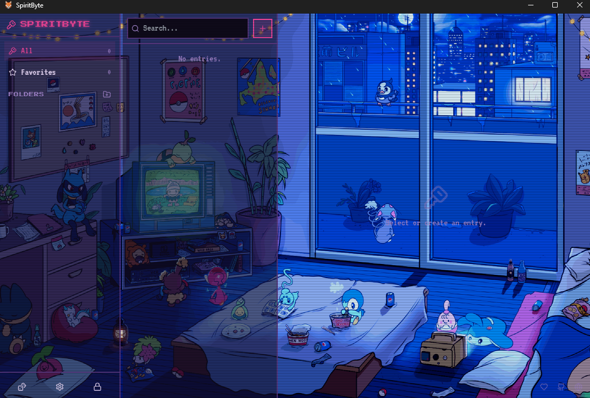

<div align="center">

# SpiritByte

### Local-first retro password manager

A secure, fully customizable password manager with a retro CRT/pixel aesthetic. Built with Tauri 2 (Rust) + React/TypeScript. Your data never leaves your device.

[](https://v2.tauri.app/)
[](https://www.rust-lang.org/)
[](https://react.dev/)
[](https://www.typescriptlang.org/)
[](LICENSE)

[Features](#features) &middot; [Backups](#encrypted-backups) &middot; [Performance](#performance) &middot; [Security](#security-model) &middot; [Install](#installation) &middot; [Build](#building-from-source) &middot; [Architecture](#architecture)

</div>

---

## Screenshots

<table>
  <tr>
    <td width="50%" align="center"><b>MSI Installer (WiX)</b></td>
    <td width="50%" align="center"><b>Onboarding — Master Key Setup</b></td>
  </tr>
  <tr>
    <td></td>
    <td></td>
  </tr>
</table>

<details>
<summary>Theme customization</summary>

<table>
  <tr>
    <td width="33%" align="center"><b>Solid</b></td>
    <td width="33%" align="center"><b>Gradient</b></td>
    <td width="33%" align="center"><b>Image / GIF</b></td>
  </tr>
  <tr>
    <td></td>
    <td></td>
    <td></td>
  </tr>
</table>

</details>

## Features

**Cryptography**
- Argon2id key derivation + XChaCha20-Poly1305 authenticated encryption
- Envelope encryption: a random DEK encrypts the vault, wrapped twice (master password + BIP39 recovery phrase)
- 12-word BIP39 recovery phrase for full access recovery
- All secrets are zeroized in memory — the DEK and master password never leave the Rust process

**Vault Management**
- Entries with title, username, password, URL, and notes
- Nested folders with custom icons and colors
- Favorites, full-text search, and keyboard-driven workflow
- Selectable notes with a one-click copy-all button
- Password-protected encrypted vault import/export from Settings
- Configurable password generator with entropy strength meter
- Auto-lock on inactivity and automatic clipboard clearing

**Customization**
- Multiple preset palettes + custom color editor (live preview)
- Retro typography (Press Start 2P, VT323, Geist Pixel) with adjustable font size
- Backgrounds: solid, gradient, or custom image
- CRT effects: scanlines, glow, flicker, and Bayer 8x8 dithered splash screen

**Cross-platform**
- Native installers for Windows (MSI via WiX, NSIS), macOS, and Linux
- Multilingual: English and Spanish with runtime switching

> [!TIP]
> SpiritByte stores everything locally in your OS app-data directory. No servers, no accounts, no telemetry. Your encrypted vault is the only artifact that matters.

## Security Model

| Artifact | Contents | Encryption |
|---|---|---|
| `vault.dat` | Entries and folders | XChaCha20-Poly1305 (DEK) |
| `vault.meta.json` | Salts, Argon2 params, wrapped DEK (x2) | No plaintext secrets |
| `settings.json` | UI preferences | Plaintext (non-sensitive) |

```
Master Password ──┐
                  ├──(Argon2id)──> DEK ──> XChaCha20-Poly1305 ──> vault.dat
Recovery Phrase ──┘
```

> [!WARNING]
> If you lose **both** your master password **and** your 12-word recovery phrase, the vault is unrecoverable by design. There is no backdoor.

## Encrypted backups

Choose **All** to export the entire vault, or **Select** to choose folders and individual credentials. Checking a folder selects its contents and subfolders; uncheck any individual credentials to exclude them. Required parent folders, icons and colors are preserved automatically. Explicitly selected empty folders can also be exported. **Clear** resets the selection, and an empty selection cannot be exported.

In **Settings > Import / Export vault**, choose a long, unique backup password (at least 12 characters), use the strength meter as guidance, confirm it, and export to a new `.spiritbyte` file using the native save dialog. The live character counter and matching-password indicator show when export is enabled; the strength estimate is advisory. Keep the password separately: the vault recovery phrase cannot unlock this backup. Existing files are never overwritten.

To restore, create or unlock a destination vault, select the backup in Settings, enter its backup password, and choose **Import and add**. All entries (including notes, favorites, timestamps and icons), folders and parent relationships are preserved. Imported records receive fresh IDs, so existing records are retained; importing twice creates duplicates. Visual preferences, wallpapers, master credentials and recovery phrases are not included. The destination vault keeps its own credentials.

Format v1 uses fixed Argon2id parameters (64 MiB, 3 iterations, 1 lane), a fresh random salt, and XChaCha20-Poly1305 authenticated encryption with a fresh nonce. No decrypted backup is written to disk. Imports are limited to 32 MiB and authenticated and structurally validated before merging. The encrypted vault is synced to a sibling temporary file and atomically replaced before the session is updated.

## Performance

- Search sorting and normalized text are cached until entries change, avoiding repeated sorting while typing or switching folders.
- Entry and folder saves update the affected frontend records without fetching the entire vault again. Unchanged entry rows reuse their rendered output.
- Password strength checks are debounced, and the inactivity timer tracks activity without recreating a timeout on every mouse movement.
- The splash precomputes its shaded Bayer-dithered fox once, then reveals the cached artwork. Its vector facets, subtle phosphor glow and scan sweep follow the active palette; reduced-motion preferences skip the sweep.
- Pending saves and refreshes cannot repopulate the frontend after locking. Vault writes use atomic replacement, and failed saves retain the previous data.

## Installation

### Pre-built binaries

Download the latest installer from the [Releases](https://github.com/OscarTired/SpiritByte-V2/releases) page:

| Platform | Installer |
|---|---|
| Windows | `.msi` (WiX) or `-setup.exe` (NSIS) |
| macOS | `.dmg` |
| Linux | `.deb` / `.AppImage` |

### Updating on Windows

For version 0.1.1, close SpiritByte and run the new installer using the same installer format as your current installation (MSI or NSIS EXE). Install over the existing version; there is no need to uninstall first. The application identifier and MSI upgrade code remain unchanged, and the vault stays in the existing app-data directory. The `src-tauri/target` directory contains build artifacts only and is regenerated when building.

### Building from source

**Prerequisites**

- [Node.js](https://nodejs.org/) 18+ and [pnpm](https://pnpm.io/)
- [Rust](https://www.rust-lang.org/tools/install) toolchain (`cargo`)
- Platform-specific Tauri [prerequisites](https://v2.tauri.app/start/prerequisites/)

**Development**

```bash
pnpm install
pnpm tauri dev
```

**Production build**

```bash
pnpm tauri build
```

**Run crypto tests**

```bash
cd src-tauri
cargo test --manifest-path ../../SpiritByte-Android/core/Cargo.toml
```

The vault engine now lives in the sibling `SpiritByte-Android/core` library and is
shared with the native Kotlin/Compose Android app. Keep both project directories
side by side; `src-tauri/src/{crypto,vault,backup,generator}.rs` are compatibility
re-exports. Make engine changes in `SpiritByte-Android/core/src`.

## Architecture

```
src/                       Frontend (React + TypeScript)
  components/              UI primitives, SplashFox, StrengthMeter
  features/                generator, entries, settings
  screens/                 Onboarding, Unlock, VaultApp
  store/                   Zustand state (useVault, useSettings)
  theme/                   Palettes + theme application (CSS vars)
  lib/                     API bridge, clipboard, auto-lock, types

src-tauri/src/             Backend (Rust)
  crypto.rs                Argon2id, XChaCha20-Poly1305, BIP39
  vault.rs                 Data model, on-disk format, operations
  backup.rs                Encrypted portable backups, validation and additive restore
  generator.rs             Password generator + strength estimation
  state.rs                 Session state (DEK in memory)
  commands.rs              Tauri IPC commands exposed to frontend
```

<details>
<summary>Tech stack</summary>

| Layer | Technology |
|---|---|
| Desktop runtime | Tauri 2 |
| Backend | Rust (argon2, chacha20poly1305, bip39, zeroize) |
| Frontend | React 18, TypeScript 5.6 |
| State | Zustand 5 |
| Styling | Tailwind CSS 3.4 |
| Icons | Lucide React |
| Fonts | Press Start 2P, VT323, Geist Pixel (5 variants) |

</details>

## Roadmap

- [x] Password-protected encrypted vault import/export (`.spiritbyte`)
- [x] Search, rendering, clipboard feedback and inactivity-timer improvements
- [ ] Browser extension autofill

## Contributing

Contributions are welcome. Please open an issue first to discuss what you would like to change.

1. Fork the repository
2. Create a feature branch (`git checkout -b feat/my-feature`)
3. Commit your changes
4. Open a pull request

## Support

If you find SpiritByte useful, consider supporting the project:

[](https://paypal.me/octacodec)
[](https://github.com/OscarTired)
[](https://octa-dev.com/)

## License

[MIT](LICENSE)
